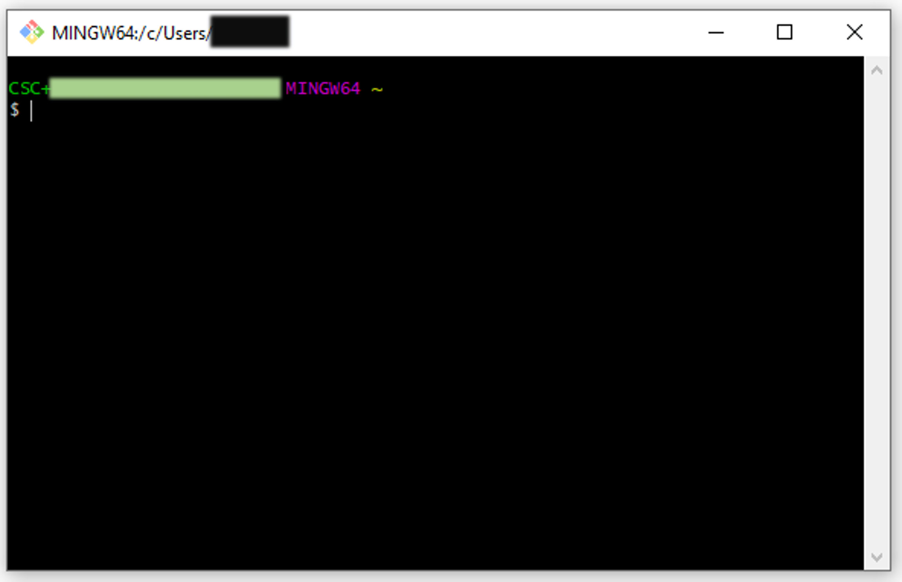

# Lesson 1: Git Intro + Install

[[_TOC_]]

## Learning Objectives

1. Understand the use-case for version control, and git
2. Distinguish between git and hosting services such as github or Azure DevOps
3. Setup git and the requisite proxy settings on your workstation

## Why version-control?

Version control (or source-control) is the practise of tracking changes to files/code over time. There are many benefits to version-control:
+ The ability to roll-back changes if errors are found 
+ Revisit earlier versions of files
+ Distinguish between experimental code and code that has been released/is in production
+ <mark>TODO: [add a few more]</mark>

Ideally, we don't want to find ourselves in these kind of situations, **especially with code**:

<kbd>

</kbd>

## What is Git?

[In their own words](https://git-scm.com/):
>   Git is a free and open source distributed version control system designed to handle everything from small to very large projects with speed and efficiency.
> 

Git is one of many version control softwares, but is one of the [most popular](https://rhodecode.com/insights/version-control-systems-2016#:~:text=To%20sum%20this%20up%3A,Mozilla%2C%20Nginx%2C%20and%20NetBeans.).

But really, Git helps us to:
1. Track changes across multiple files
2. Develop multiple versions of a project simultaneously
3. Explore the state of a project at some arbitrary point in the past
4. Collaborate with others on the same codebase
5. Provides tools to integrate changes (in a somewhat) systematic way

Here's a quick example of how git integrates into our workflow. Think of each bubble as a "save-point" :
1. We start a new project with our program area partners
2. Soon after, we finish work on a fairly involved script to get us the data to create a report.
3. After some hard work, we've created the initial report with most of the features requested. But our deadline is approaching, and we need to share it with our program partners.
4. We share the initial report (V1.0.0) with our partners for their initial feedback.
5. In the meantime, we start work on a backlogged feature as review continues.
6. We end up finishing the feature, and we're able to incorporate the feature into another realease (V.1.1.0).

Bonus! This whole course was version-controlled from Day-1; You could walk back to see how it looked if you so choose!

## What is Github/Azure DevOps?
**Git =/= Github!**

You can use git's version control capabilities without ever having to understand Github.

Github is a service that holds git repositories. There are many companies  that offer hosting for git repositories, such as [BitBucket](https://bitbucket.org/product), [GitLab](https://about.gitlab.com/), [SourceForge](https://sourceforge.net/) etc.  As they are hosted on the www, they make it easier to collaborate with others on the same codebase. 

[Azure DevOps](https://azure.microsoft.com/en-us/services/devops/) also provides git hosting capabilities as part of its Dev Ops services. This is what we will use.

## Installation Instructions

### Git
Download [git for Windows from here (standalone installer)](https://git-scm.com/download/win). You might need admin privileges to install git. 

Additionally, since you're most likely using a Windows-based machine, you will need to set some defaults. During install, set the following defaults (click for pics):

+ [Use Git from Git Bash only](assets/03_git_install.png)
+ [Use the OpenSSL Library](assets/04_git_install.png)
+ [Checkout Windows-style, commit Unix-style line endings](assets/05_git_install.png)
+ [Use MinTTYP (the default terminal of MSYS2)](assets/06_git_install.jpg)
+ [Change default text editor for git](assets/07_git_install.png)
+ [Install Git Credential Manager](assets/08_git_install.png)
+ [Change default repository name in git](assets/09_git_install.png)

#### Opening Git

We will primarily use the command line interface (CLI). If the installed was successful, git bash should open, and it looks like this:

### Azure DevOps

<mark>TODO: Setup SSL from git; Tokens setup</mark>

## References

