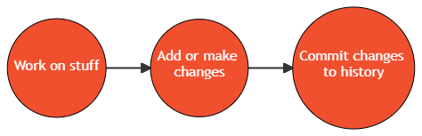

# Lesson 2: Git Basics

## Conceptual Overview

+ A git repository (AKA repo) is an "area" that git (the software) tracks changes to files and folders happening within. Git keeps a running history of changes happening to files: changes as minor as the addition of a simple blank space in a sentence. 

+ Think of it as a very nosy neighbour/HOA keeping tabs on everything happening in your neighbourhood/repository - but *worse* they have all the evidence from the beginning of time, and can bring them up at any point.

+ Git repositories are self-contained. Each project initiated will have its own separate history. For example, for the three repositories below, we'd have three independent workspaces, with their own unique histories:

## Basic Workflow

The basic workflow is:

+ **Work on things**: Create files, edit them, etc.
+ **Add/Stage changes**: Group logically related changes together prior to committing across one or multiple files.
+ **Commit changes to repo**: "Add a bubble to the chain". This unit of work (or snapshot) is now saved/source-controlled.

### A contrived example

I have been working on a new data visualization. In my work folder, there are three files:

1.  **viz_script.R** : A file that creates the visualization
2.  **powerpoint_for_review.pptx**: A PowerPoint file that'll contain the updated visualization.
3.  **TODO.txt**: A text file of all the changes that have been requested of this viz.
	- [ ] Viz: Change the chart type from line to bar chart
	- [ ] Viz: Change the background-color of the chart from white to light-grey
	- [ ] Viz: Update the data with latest month's
	- [ ] PPT: Update the figures in the PowerPoint
	- [ ] PPT: Use active voice within the slides

At 9AM, I did two changes on the viz, and 1 within the ppt. Later on, I changed the chart type on the viz, and then changed all passive voice in the ppt to active voice.

