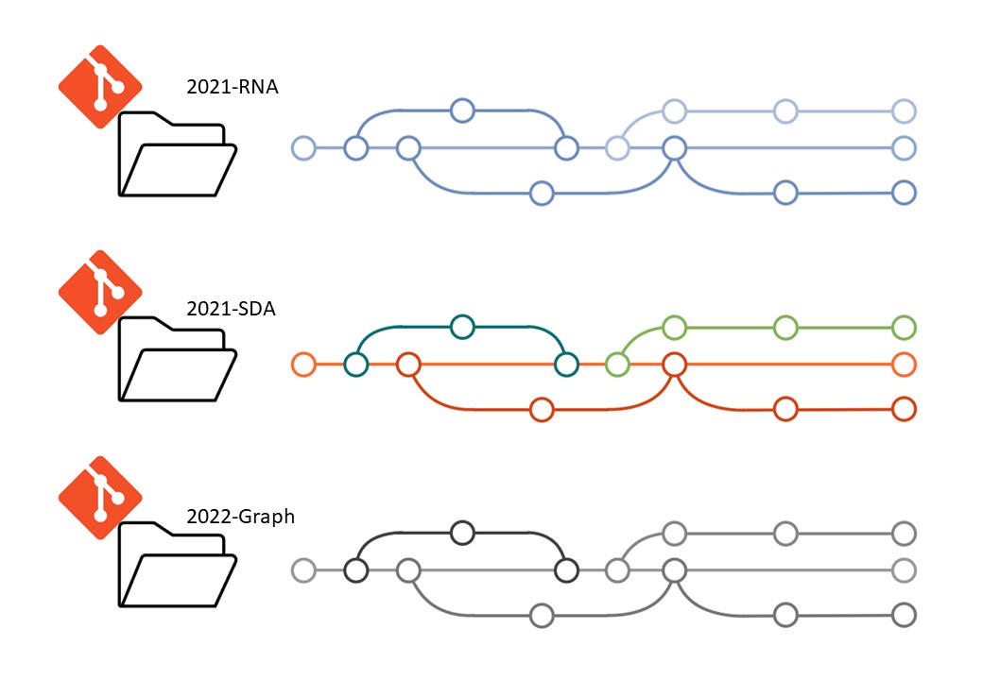
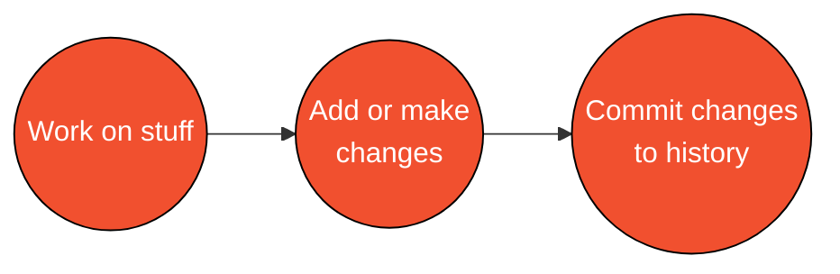

# Lesson 2: Git Basics

## Conceptual Overview

+ A git repository (AKA repo) is an "area" that git (the software) tracks changes to files and folders happening within. Git keeps a running history of changes happening to files: changes as minor as the addition of a simple blank space in a sentence. 

+ Think of it as a very nosy neighbour/HOA keeping tabs on everything happening in your neighbourhood/repository - but *worse* they have all the evidence from the beginning of time, and can bring them up at any point.

+ Git repositories are self-contained. Each project initiated will have its own separate history. For example, for the three repositories below, we'd have three independent workspaces, with their own unique histories:

<kbd>

</kbd>

## Basic Workflow

+ The basic workflow is:
1. **Work on things**
2. **Add or make changes**
3. **Commit changes**

