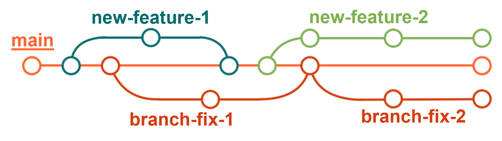
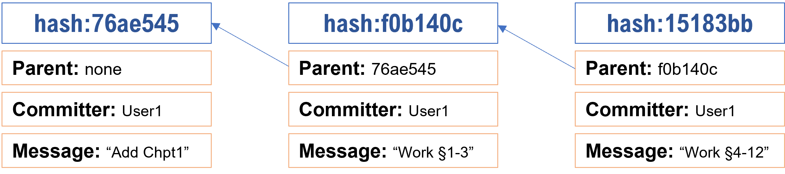
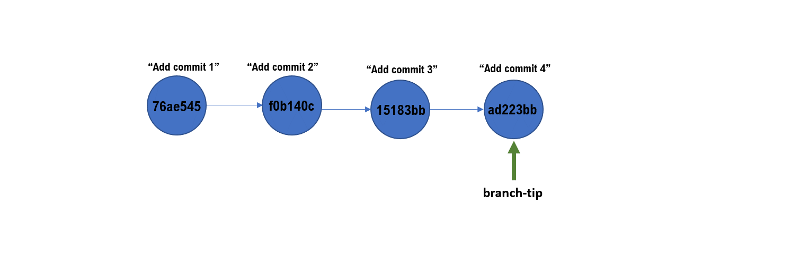

# Lesson 3: Git Branching

[[_TOC_]]

## Learning Objectives

1. Understand the context for branching and its benefits
2. Understand the basics of pointers in git (HEAD/detached HEAD, etc.)
3. Understand the basics of `git branch`, `git switch`
4. Be able to create, switch, and delete branches

## What are branches/why are they needed?

Branches are what makes git special. While the definition of a branch itself may not be very helpful at this point ([a branch is a lightweight movable pointer to a particular commit](https://git-scm.com/book/en/v2/Git-Branching-Branches-in-a-Nutshell)), branching essentially allows us to diverge from the main development line and continue working without affecting the main line at all. Think of them as alternative timelines for the same project.

Branches can be very helpful if:

+ you want to test a radical idea for your code-base but do not want to mess your previous work
+ you need to fix a bug in your code, but don't want to affect the code-base even more as you tinker around 
+ you want to develop a new feature 
+ you are collaborating on the same code-base with others and want to work concurrently

By now, we've seen the usual work-stage-commit workflow. Here's how a mature git repo might look:

In this picture, we have 5 branches:

+ main (aka as "master") branch in orange
+ new-feature-1
+ branch-fix-1
+ branch-fix-2
+ new-feature-2

Notice that `new-feature-1` was branched off when `main` had two commits in. That means `new-feature-1` will have an exact snapshot of the code-base as it looked at that point. As work continued on that branch, another branch `branch-fix-1` was created after `main` received yet another commit. When `new-feature-1` was ready, changes from both `main` and `new-feature-1` were consolidated, in a process called **merging**. We will cover merging in a subsequent lesson.

### About the main branch

There's nothing special about the main branch: it is a branch and has the exact same functionality as any other. Git uses main as its default name. By convention though, teams tend to designate one branch as their source of "one-truth", and often that role falls to the main branch. 

Note: In 2020, Github [renamed the default branch](https://github.com/github/renaming) from **master** to **main** amongst other changes, and git itself is planning to do the same in the future. Note that you might see "master" used in online documentations/books etc.

## Git internals: Hashes, Pointers, and (detached) HEAD

How does git keep track of changes, and how is a a commit history kept straight? By way of unique identifiers and pointers.

### SHA-1

Git uses a crytographic function (SHA-1) that guarantees the following:

1. Fixed length output (40 digits) from an input of arbitrary length
2. The same input guarantees the same output
3. Minor deviations between inputs lead to drastic differences in the output
	+ Feeding "IAE" to SHA-1 returns `233ed065ce5a1aa80d3d930be6a8a5fd850963a3`	
	+ Feeding "IAe" to SHA-1 returns `323a6905d656be822184e40067f82d26468376de`
4. There should be no collisions: two inputs should not give the same output*
5. Reverse-engineering the output to determine the input should not be possible (or *exceedingly* difficult)

*Note:* [SHA-1 has been broken (a collision has been discovered)](https://phys.org/news/2017-02-cwi-google-collision-industry-standard.html), but still has many applications nonetheless. SHA-256 is now experimental in Git.

### Commit internals

For every commit, a hash is run creating a unique identifier for that "snapshot". Other pieces of information that are saved within the commit are:

1. The commit message
2. The committer's name/email
3. A reference to the previous commit (hash of the parent commit(s))

Every time we add a new commit, we "grow the chain". By linking commits together, git is able to traverse multiple commits and determine **how various commits are interrelated**.

But how does Git know what the latest commit is for each branch? For that, Git uses **pointers**. A pointer is essentially an "address" or a "reference". By looking up what the pointer is "looking at" Git knows where the latest commit in a branch or in main is.

For each branch created, Git keeps a record of where the "tip of the branch" is. With each commit, the branch-tip is updated to the latest commit:

Similarly, if a project has multiple branches, git will store a pointer for the tip of each branch. Here, the green branch is created at `commit 15183bb`, prompting git to store another pointer for the green branch. At commit 3, they both point to the same commit - their common parent.

### Locating the user: the HEAD pointer

We now understand (hopefully) how git internally represents how commits are related to each other. The user (you) may decide at any point to checkout work that was done a few days, or months ago. To allow the user to freely move about, while retaining a sense of the "latest state" of the repo, git implements (yet another) pointer called **HEAD**. 

HEAD refers to the current location of the user/the branch or commit that is currently checked out. **Generally**, it'll point to a particular branch at the branch's tip - this is the default state (attached state).

In the animation below, the user's workspace is consistent with the tip of the branch they're working on. They're in **attached** state throughout, as HEAD is in-sync with the branch-tip at every step of the commit-history. In other words, the user's workspace has the the latest work, and they're working at the tip of the repo. Note that the HEAD pointer *points* to another pointer (branch-tip), and not directly at the commit itself.

If the user wanted to see the changes as part of another commit (say commit 2), they are able to "travel" to that commit. But since they're no longer in-sync with the latest commit on that branch, the user is said to be in **detached head** state.

Any decoupling of the branch-tip pointer and the HEAD pointer is sufficient to cause the user to be in detached state. Notice as well that HEAD now points directly to a commit, while the branch-tip keeps pointing at the last commit #4.

## Branching commands

Here we'll see the commands that help us create branches, switch between branches, switch to a named commit (by its hash). Finally we'll see how to delete a branch.

### Create a branch
To create a branch you use the **`git branch <branch-name>`** command with a particular branch-name.  It will create the branch at the location you are at. This command will only create the branch, but won't move you to that branch. 

#### List all the branches in the repository
Use `git branch -v` to list all the branches available on your local repository.

#### Switching to a branch
Use the `git switch <branch-name>` to move to a particular branch

#### Switching to a commit
Use `git checkout <hash>` command. To move to a particular commit (minimum of 7 out of 40 hash characters needed) . This will most certainly put you in detached head state.
 
 ----
 