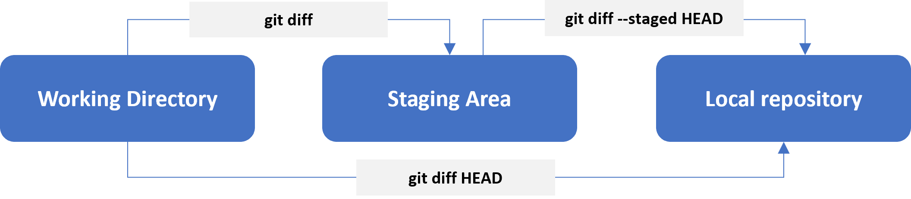

# Lesson 4: Finding differences

[[_TOC_]]

## Learning Objectives

1. Understand the output of `git diff` and common options to it
2. Understand the use-case for `git stash`

## Keeping track of changes

We've seen how we can navigate between commits. If we wanted to compare the changes made between commits, we can do so using `git diff`. 

Depending on the parameters used when invoking `git diff`, the comparison can be made between any two arbitrary commits. Often it can be used to compare:

1. Your working directory (as in the most recent changes made) and the last commit in your repo
2. The change from what you've staged and what's in your working directory
3. The change between two arbitrary commits

## The `git diff` command

By default, the command will look for all changes across all files between two commits. One can specify exactly which commit/branch, as well as which file to compare to make the output more manageable.

### Running: `git diff`

Running git diff with no further parameters will compare changes in your working directory and changes (if any) that have been staged. If staged changes and working directory are the same, there will be no output.

### Running: `git diff HEAD`

Running git diff HEAD will compare changes in the working directory and the last commit in HEAD. If there are no changes in the working directory (whether staged or not), <mark> there will be no output.</mark>

### Running: `git diff --staged HEAD`

Run git diff --staged HEAD will compare the difference between what's been staged and the last commit in HEAD. If nothing is staged, <mark>there will be no output</mark>

Here's a summary of the above:

## Interpreting the output from `git diff`

