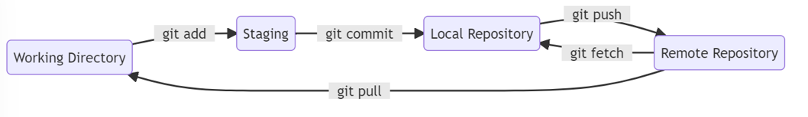
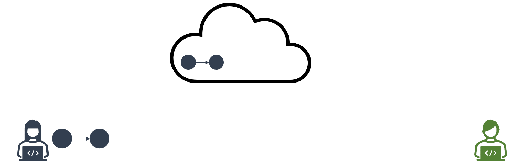
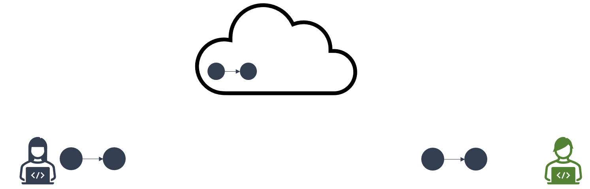
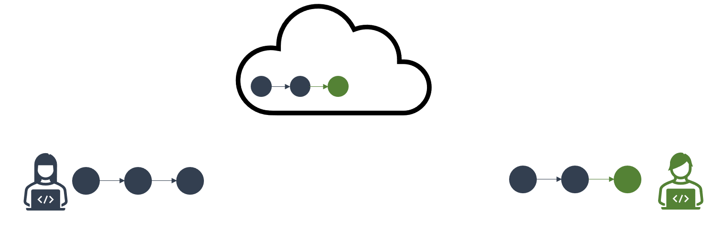
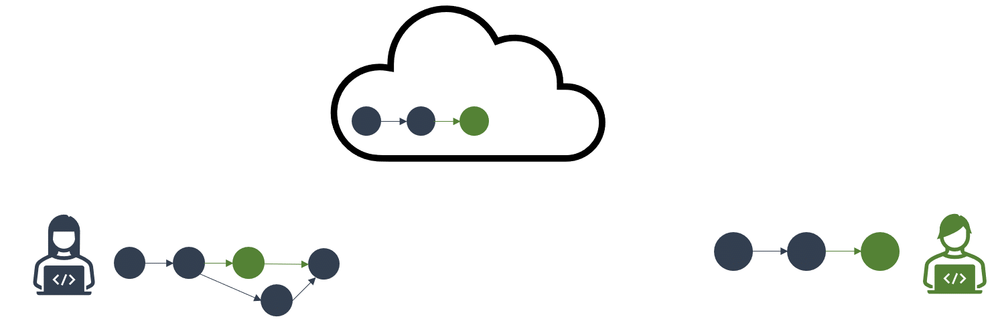
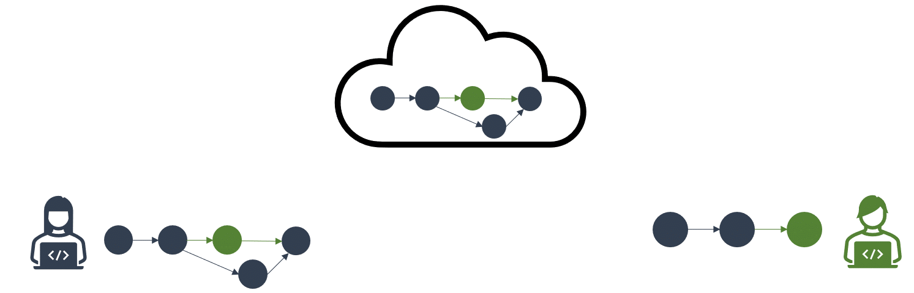

# Lesson 6: Working with remotes
[[_TOC_]]

## By the end of this module, you will be able to:

1. Understand `git push`, `git fetch`, `git pull`, and typical workflow with remote repos.
2. Understand how to set-up your own Github/Azure DevOps account. 

## Introduction

Git lets developers keep track of their own code-base. It also provides functionality if users want to collaborate with others on the same code-base.

While repositories can be used locally (on the same machine), git provides functionality to work with others that have different setups/that are remote.

Having a remote repository also has other benefits:

1. Collaboration with others
2. In case of hardware failure, a backup is available elsewhere
3. Allow others to 'fork'/or expand on your work (if you allow it)

Many firms other free repository hosting. Github is probably the most popular. Here, we will use the Azure DevOps. 

## What are remotes exactly?

Remotes are versions of your project that are **stored elsewhere**. A remote can reside on another host/server, the Internet, or even on the same machine. 

Other users cannot "modify" your local repository but they may contribute to the remote repository. This is how interaction with others happens.

## Working with Remotes

### Local 🠚 Remote

So far, we've been working in a "local" workflow. We have seen the **working directory**, **staging**, and **local repository** as three main work trees that git keeps track of. Think of remotes as yet another work tree that behaves in a (mostly) similar fashion.

To the **work-stage-commit** workflow, we add function `git push`. 
As long as a remote has been set-up, `git push ` will copy over the changes from your local commit(s) onto the remote branch. We will cover `git push` more extensively below.

### Remote 🠚 Local

Often, there will be changes that have been pushed to the remote that we don't have in our local repository. Git provides commands to "gather" these changes from the remote.

`git fetch` transfers changes from the remote and plops those changes into your local repository. By design `git fetch` will not attempt to reconcile changes with what's in your workspace. `git fetch` allows you to explore the remote changes in a more controlled manner.

If, you wanted git to reconcile the changes, `git pull` will fetch, download, and immediately update the local repository to match the content on the remote.  `git pull` attempts both a fetch and a merge in one go. Having uncommitted changes locally in the workspace may cause conflicts.

### Setting up a remote

Since remotes are versions of the project saved elsewhere, we need to tell git the "address" of the remote. 

Here, name refers to the name of the remote. Often, the default name of remotes is "origin".

`git remote add <name> <url>`

A repository may have multiple remote repositories set-up. 

### Viewing remotes

To view a list of remotes set up with your current repository:

`git remote -v`

To view a list of branches available on the remote:

`git remote -r` 

## Downloading a remote branch

By default, cloning a project will only copy over the main branch. To download a named branch from the remote:

`git switch <remote-branch-name>`

### Cloning a remote

To clone an existing remote repository, use:

`git clone <url>`

**NOTE:** If you have cloned a repository, the remote address is also copied over.

## An example of a workflow

In this example, we have two users: Jack and Jill. They are both working on a data analysis project. In this project, there are two files:

+ data-generation-script.sql
+ data-analysis-script.r

### Step 1: Project initiation

+ Jill starts the project shell, and creates the base files. She also starts the SQL script. She commits, and pushes to the remote before heading for lunch.

### Step 2: Jack onboarded.

+ Jack has been assigned as a resource and clones the project. He receives the first 2 commits, and starts work on the analysis script.

### Step 3: Commits

+ Jack is ready to commit the first few changes on the data-analysis script and pushes to the remote. 
+ In the meantime, Jill has refactored the SQL script, and found more efficient ways to obtain the data. She attempts to push her changes as well.
+ Because Jill's local repo was out of step with the remote, the `push` fails, even if the files being modified are different.

### Step 4: Resolve histories **locally**

+ To resolve, Jill `git pull` changes from the remote, then integrates with her local code-base, dealing with merge conflicts if they exist. 
+ Once all conflicts are fixed, Jill has a new resolved history on her local repository. A merge-commit is created to show convergence. 
+ Resolving conflicts with a remote is similar to resolving merge conflicts when merging two branches.

### Step 5: Update the remote

+ Jill now pushes her changes back to the remote. 
+ The remote now has all the changes, including a history of the divergence between Jack/Jill, and re-convergence with the merge-commit.

### Step 6: Collaborators update their locals

+ Jack resumes work on his local. Before starting he `git pull` changes from the remote to ensure his local is up-to-date.

## Working with Github

### Setting up your Github account

+ First, navigate to [Github](https://github.com/). Registering for an account will require a username and a password.
+ Next, you will need to set-up Secure Shell (SSH) keys to allow your PC to interact with Github, without having to input a username/personal access token everytime. Otherwise, you can setup a Personal Access Token (PAT).

### Pushing an existing repo to Github

If you have an existing repo that is local on your terminal that you want to move to Github, the steps to get your repo remotely are:

1. Create an empty repository on Github
2. Add in the remote link (github path) to your local repository.
3. Push the repository up on Github 

### Cloning a repo

If you have a repo (or want to grab an open-source one) that is already on Github, you can "clone" the repo onto your local machine.

1. Identify the repository that you want to clone, and copy its address
2. Use `git clone <address>` to clone the repo based on where your terminal's working directory is.
3. By default, `git clone` will clone only the `main` branch. To copy over a specific branch, you can use  `git switch <remote-branch-name>`.

### 
