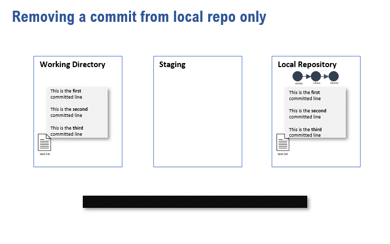
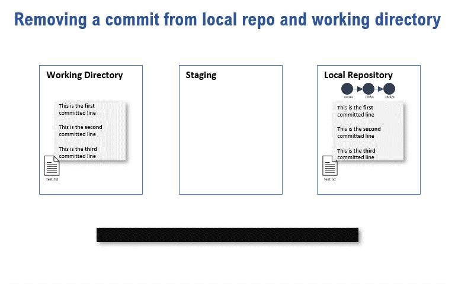

# Lesson 7: Stashing, Restoring, Resetting, and Reverting Changes

[[_TOC_]]

## By the end of this module, you will be able to:
1. understand when to use `git stash`.
3. understand the differences and use-cases for `git restore`, `git reset` and `git revert`.

## Stockpiling work - `git stash`

Sometimes, you might be working on your branch, but you need to switch to another branch to do some higher priority work. This can become a problem especially if the changes have not/are not yet ready to be committed.

If you `git switch <branch>` to another branch with changes that have not been tracked/committed, one of two things may happen:

1. Git stops you from switching due to conflicts that would arise if it were to update your working directory

2. Git allows you to switch, but "ports" over any untracked files to your other branch.

### In the case of conflicts

If there are conflicts, the `git switch` action will fail. This is the error message that you might see: 

>error: Your local changes to the following file would be overwritten by checkout. Please commit your changes or stash them before you switch branches
>

`git stash` allows you to "put away" your changes. This is the safest thing to do prior to moving away from a branch.

`git stash pop` is used to reinstate the changes onto your work directory. "Popping" changes can happen on any branch; it is not necessary to be on the same branch where changes were stashed.

### Untracked changes between branches

This is a peculiar git behaviour. If changes are untracked between branches, git has no sense to which branch these untracked files belong to. In this situation, the untracked files will not be removed and will still be visible after a `git switch`.

In this scenario, use `git stash -u` to instruct git to also include untracked files as part of the stashed changes

## "Undoing" in git

Often, you will want to undo changes as you work with git. Depending on where the "undoing" needs to happen in the work-stage-commit-push workflow, git provides multiple commands to do so. Ideally, changes are caught early in the process, as undoing changes in a remote is much more difficult (and downright not recommended in many cases), than fixing issues before they're committed locally.

### Restore

If you have made changes on a file but realise you want to go back to the version of the **file in the last commit**, use `git restore <file>`.

If you have staged a file by mistake and want to unstage that change, use `git restore --staged <file>`.

### Resetting

git reset is used when you have to take out commits from your local history. Think of `git reset` as a "rewind" function or a pointer resetting operation, not a deletion operation. Often those "resetted" commits are still accessible.

Resetting is not recommended if changes have been pushed remotely. Instead, `git revert` is preferable.

To reset, use `git reset <hash>`. Hash here will be what you're resetting to. If you want to reset to the state two commits ago, you would use the hash from three commits ago. 

There are two common flags used with git reset, depending on what end-state to the working directory is desired.

---

`git reset <hash>` with no further flags will rewind the change, but not otherwise modify the working directory. Running a `git status` would show `

---

`git reset --hard <hash>` will rewind the change, and also reset the working directory to that commit. All changes (committed, uncommmited) will be removed.

### Reverting

With `git revert <hash>` errors that have been pushed and potentially pulled by others is more formally dealt with.  A new commit is created to say that a particular commit has been reversed. This is easier for collaborators to then pull and update their own repos.

