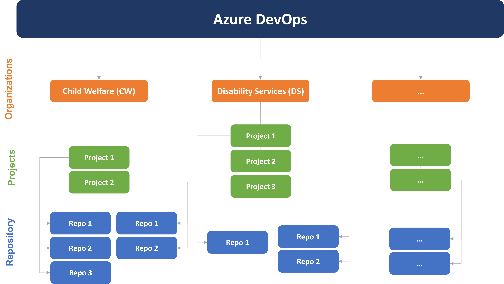

# Lesson 8: An IAE specific workflow
[[_TOC_]]

## By the end of this module, you will be able to:
1. understand how to organize your work within IAE's ADP instance.

_This is current as of 2022-08-16_

## Introduction

This lesson is specfic to BIPD's IAE and describes a working workflow. I anticipate that this unit may not be as modular for others, but provides but one way to set up your operations.

At the time of writing:

+ Data Lake environment is still being tested and is not covered here. 

## Azure DevOps Basics

Azure DevOps provides multiple levels of hierarchy:

1. [Organizations](https://docs.microsoft.com/en-us/azure/devops/organizations/accounts/organization-management?view=azure-devops): Top level domain to access ADP services and manage access, permissions, etc.
   	
2. [Projects](https://docs.microsoft.com/en-us/azure/devops/organizations/projects/about-projects?view=azure-devops): A project a space for user to work on source code together. At creation, a team is also created. Permissions can be set at this level. Note that data between projects can be hard to cross-link.
   	
3. [Repositories](https://docs.microsoft.com/en-us/azure/devops/repos/git/create-new-repo?toc=%2Fazure%2Fdevops%2Forganizations%2Ftoc.json&bc=%2Fazure%2Fdevops%2Forganizations%2Fbreadcrumb%2Ftoc.json&view=azure-devops): A project can have an unlimited amount of repos. Permissions to the repo can be set (read/read-write etc.)
  
 
## <mark> Everything following is up for discussion </mark>

## IAE Organising Principles

1. Each program area within MCCSS will be its own **organization**.
2. Within each program, **projects** will be created to deal with activities that are ongoing, and retired as needed.
3. Follow the same naming convention when naming projects with those on the shared drive.()

Here's an example of how our ADP architecture might look like:

## IAE's DevOps philosophy

### 1. Commit often, perfect later, publish once.

It is much better to commit multiple smaller changes than packaging all of them into one, as small commits make it easier to find issues.

### 2. Make clean, single-purpose commits

As much as possible, keep each commit focused on one thing. Again, it's easier to troubleshoot if things break.

### 3. Write meaningful commit messages, and use the [present tense, imperative mood](https://git.kernel.org/pub/scm/git/git.git/tree/Documentation/SubmittingPatches?h=v2.36.1#n181).

Having meaningful and consistent messages help us save time when going through the repo's history. 

### 4. Do not modify published history

Once published, resist (at all cost) the temptation to force a change upstream as others may have branched off/started working on shared history. A strong rationale is required to change history (cosmetics not enough) and should not be attempted lightly.

Use rebase only on private branches, and with **extreme care**.

### 5. Commit only source, and not derived products

Artifacts from the execution of source code should not be published as they should be easily regenerated from the scripts.

### 6. Initialise your .gitignore within your first few commits.

By always initialising your ignore file, you decrease the risk of commiting things by mistake, especially if one is using For sensible defaults for your language [see this collection of .gitignore templates from github](https://github.com/github/gitignore)

### 7. Do not store sensitive information/API keys in your scripts!

Often, API keys or passwords are inadvertently saved within scripts themselves. There are multiple ways to get around this. See credential management options in:

+ [R](https://db.rstudio.com/best-practices/managing-credentials/)
+ [Python](https://towardsdatascience.com/keeping-credentials-safe-in-jupyter-notebooks-fbd215a8e311)
### 8. Do not commit data files into your repository.

Create generating scripts that allow users to recreate the dataset locally if needed. Even better, point towards the table on the data-lake/server.

### 9. If in doubt, don't push.

Self-explanatory