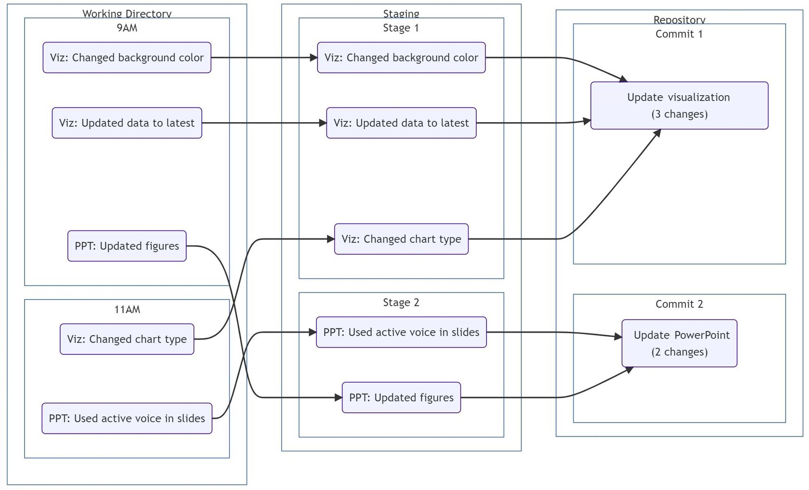

```{css, echo = FALSE}
video::-webkit-media-controls-panel {
   background-image: none !important;
   filter: brightness(0.4);
}

.span-grey{

background-color: #f2f2f2;
color: #000000;

}

.grayscale {

 filter: grayscale(100%);

}

.bg_committing {
  position: relative;
  z-index: 1;
}

.bg_committing::before {    
      content: "";
      background-image: url('assets/committing.jpg');
      background-size: cover;
      position: absolute;
      top: 0px;
      right: 0px;
      bottom: 0px;
      left: 0px;
      opacity: 0.25;
      z-index: -1;
     
}

.bg_tehc {
  position: relative;
  z-index: 1;
}

.bg_tehc::before {    
      content: "";
      background-image: url('assets/11_meme_man_tehc.jpg');
      background-size: cover;
      position: absolute;
      top: 0px;
      right: 0px;
      bottom: 0px;
      left: 0px;
      opacity: 0.5;
      z-index: -1;
     
}
```

```{r xaringanExtra-freezeframe, echo=FALSE}
xaringanExtra::use_freezeframe(responsive = FALSE)
```

```{r xaringan-scribble, echo=FALSE}
xaringanExtra::use_scribble()
```

```{r, echo=FALSE}
xaringanExtra::use_webcam()
```

# Welcome to this course on ...

--
.center[]

.center[]

???

1. Welcome 
2. How long use git
3. Intro this course + built for beginners

---

# Course Format

This course is divided into 8 sections:

--

1. **Introduction to git**

  + Deals with stuff such as why version control, installs etc.
  + Navigation basics/file manipulation in bash

--
  
2. **Git Basics**

  + Basic workflows in git (`git init`, `git add`, `git commit`)

--

3. **Git Branching**

  + Branching workflows (`git branch`, `git switch`)
  + Git internals (hashes, and pointers)

--
  
4. **Merging**

  + Three merge strategies (`git merge`)
  + Conflict resolution

---

# Course Format (cont.)

5. **Finding differences**

  + `git diff` between your various work trees

--

6. **Working with Remotes**

  + Intro to collaboration with others (`git push`, `git fetch`, `git pull`)
  + Setting up your personal GitHub

--

7. **Fixing stuff when things go wrong**

 + When to use `git restore` or `git revert` or `git reset`!

--

8. **IAE Specific Workflows**

 + Best practices for source-control + our use of DevOps.
 
---

# Course Delivery

+ This course is meant to be **interactive**. I'll go over the main content,
do a few on the fly examples to illustrate. Highly encourage you code-along where
possible.

+ Afterwards, there are "lab" exercises that also allow you to practise the material on your own time.

+ Feel free to interrupt me if there's anything that's unclear. I'm testing out online
delivery for the first time, so it might be a bit choppy initially.


---

# Why are we using the command-line-interface (CLI)...?!?!??#@

+  We might all use different IDEs/text-editors. We'd have to spend time on integration piece. **TLDR**: git is tool/domain agnostic

+ Understanding git itself allows you to troubleshoot more effectively.

+ It's fairly trivial to add in a git wrapper/GUI once some of the baser concepts are understood.

+ Get (more) familiar with UNIX/Linux commands

--

+ Impress your co-workers (your mileage may vary here)


.center[]

--

---

# By the end of this course, you'll (hopefully) be able to:

--

+ **source control for yourself** using the command-line interface (CLI)

--

+ **understand the basics** of how git commits work and typical local workflows

--

+ merge changes, and **resolve simple conflicts** between your local/remote branches

--

+ **troubleshoot** and follow online discourse on StackOverflow/github, and the official docs

--

+ start **collaborating** on source code.

--

.center[]


---
background-color: black
background-size: contain
class: center, inverse

# Lesson 1: Git Intro


---

# Why version-control?


Version control (or source-control) is the practise of tracking changes to files/code over time. There are many benefits to version-control:

+ The ability to **roll-back changes** if errors are found
+ **Revisit** earlier versions of files
+ **Distinguish** between experimental code and code that has been released/is in production

This might look familiar: 

.center[]


---

# Why version-control? (cont.)

**Git** implements a distributed version-control system. There are other softwares that implement VC: Subversion, Mercurial, etc.

Git helps us to:

1. Track changes across multiple files
2. Develop multiple versions of a project simultaneously
3. Explore the state of a project at some arbitrary point in the past
4. Collaborate with others on the same codebase
5. Provides tools to integrate changes (in a somewhat) systematic way

---

# A motivating example
 
.center[

<video autoplay controls>
  <source src = "assets/01_anim_git-workflow.mp4" type = "video/mp4">
</video>

]

???
0. **This might be unnecessary for this group**

1. We start a new project with our program area partners
2. Soon after, we finish work on a fairly involved script to get us the data to create a report.
3. After some hard work, we've created the initial report with most of the features requested. But our deadline is approaching, and we need to share it with our program partners.
4. We share the initial report (V1.0.0) with our partners for their initial feedback.
5. In the meantime, we start work on a backlogged feature as review continues.
6. We end up finishing the feature, and we're able to incorporate the feature into another realease (V.1.1.0).

---

# Careful!

.center[

 

## is not


]

---

# Git and GitHub

+ You can use git's version control capabilities **without ever having to understand Github**.

+ GitHub is a **hosting service** that holds git repositories. 

+ There are many companies  that offer hosting for git repositories, such as [BitBucket](https://bitbucket.org/product), [GitLab](https://about.gitlab.com/), [SourceForge](https://sourceforge.net/) etc.  

+ As they are hosted on the Internet, these services **make it easier to collaborate** with others on the same codebase. 
  + We cover the integration between git and GitHub later on.


---

# Time to install stuff

+ Link to [Git install](https://git-scm.com/downloads)
+ Right-click install, run as administrator.
  + The local install path should be `C:\Program Files\Git`

+ Defaults to set:
  + [Select default components](assets/extra_git_install1.jpg)
  + [Change default text editor for git](assets/07_git_install.png)
  + [Override the default branch name in git to "main"](assets/09_git_install.png)
  + [Use Git from Git Bash only](assets/03_git_install.png)
  + [Use bundled OpenSSH](assets/extra_git_install2.jpg)
  + [Use the OpenSSL Library](assets/04_git_install.png)
  + [Checkout Windows-style, commit Unix-style line endings](assets/05_git_install.png)
  + [Use MinTTYP (the default terminal of MSYS2)](assets/06_git_install.jpg)
  + [Choose the default (fast-forward or merge) as the standard behaviour of git pull](assets/extra_git_install3.jpg)
  + [Install Git Credential Manager as credential helper](assets/08_git_install.jpg)
  + [Enable file system caching](assets/extra_git_install4.jpg)
  + [**Don't** enable experimental options](assets/extra_git_install5.jpg)


---

# Time to install stuff

+ Check whether your username is what you'd want it to be:

```bash
 
 git config --get user.name

```
  + If you want to change your username, run this:

```bash

git config --global user.name "First_Name Last_Name"

```
<hr>

+ Check default text editor:

```bash

git config --get core.editor

```

+ If it reads this: `C:\Program Files\Git\usr\bin\vim.exe`, **let me know!**

---

# Time to install stuff

+ Run this in git bash to confirm that things installed correctly:

```bash
    
    mkdir /c/git-test && cd $_
    
    git clone https://github.com/salexir/install-success.git
    
    cat install-success/README.md
```

```bash

    # Run this after
    
    cd ~
    rm -f -r /c/git-test
    
```

+ These commands create a folder, attempts to clone a GitHub repository and opens the repo's only file. These files/folders are then deleted.

+ To paste in **Git Bash**, use: *Shift+Ins*

???
Encourage typing things out here. I think you learn more?

---


# What's **Git Bash** anyway, and why do I need this?

--

+ There are many operating system families: Windows, Mac OS X, Linux etc.

--

+ Mac OS X and Linux share a common ancestor in another OS: **UNIX**

--

+ Git was developed in Linux. Git Bash provides an interface for git to communicate in a Microsoft environment. Bash also provides support for select Unix/Linux commands.

--

+ This means that some common commands that we're used to are slightly different in Git Bash
  
| Command | Windows Shortcut | Bash Shortcut |
|-|-|-|
|Copy|Ctrl + C | "Select/Highlight text to copy"|
|Paste|Ctrl + V | Shift + Insert |

+ You can modify those, but I'll stick with the bash defaults.

???
Git wasn't designed to run on Windows machines initially.

---
class: center, inverse

.center[

# Let's practise file manipulation in Bash!

]

???

1. Overview of the git bash window
2. The first command we'll use is `~`. This gives your current location/or current context.
3. How would we move around? Compare/contrast with File Explorer. *Wink wink* that spaces in file/folder names is the bane of a CLI dev's existence. 
3. **Highlight these** 
	+ Copy: Shift-highlight
	+ Paste: Shit-Insert
	+ Left-Right arrows; vs. Top-Bottom arrows
	+ The use of Ctrl + left/right arrows to move past words
	+ Why the `>` happens, and how to exit (Ctrl+C). `'` to illustrate.
2. The first command we'll use is `ls`, shorthand for list. Use it anywhere, and it'll list the files at that location. 

2. Create directory/sub-directories for Geographies (shown below)
	+ show `cd`, `..`, `ls`, `mkdir`, `touch`,  `start`, `.`, `rm`, `rm -r`
	+ relative linking as "go two buildings down" vs. absolute linking as "go to 315 front street "
3. Geographies:
  + World
  	* North America
  		- Canada
  		- Mexico
  		- USA
  	* Africa
  		- Egypt
  	* Europe
  	* Asia	


---

# Summary of Git Bash 

### Command Structure:

```bash 
command --options arguments
```

 + Options modify command behaviour. Options can be chained.

 + Commands and options are **case-sensitive**
 
 + Options may have both a long form (introduced by `--`), and a short form (introduced by `-`)
 
 + Arguments are inputs to the command.
 


---

# Summary of Git Bash (cont.)

Here's a list of shortcuts/commands that are important to know:

|Name|Expanded Name|Description|Example|
|-|-|-|-|
|[cd](https://ss64.com/bash/cd.html)| Change directory| From current position, change the current directory | `cd c/`|
|[mkdir](https://ss64.com/bash/mkdir.html)| Make a/multiple directory| From current position, create the current directory|**Single**: `mkdir testFolder`<br>**Multiple**: `mkdir dir1 dir2 dir3`|
|[pwd](https://ss64.com/bash/pwd.html)|Print working directory| Get user's current directory| `pwd`|


---

# Summary of Git Bash (cont.)

|Name|Expanded Name|Description|Example|
|-|-|-|-|
|[ls](https://ss64.com/bash/ls.html)|List files (+ info about them)| From current position, list all the contents within the directory.|`ls`|
|[start](https://docs.microsoft.com/en-us/windows-server/administration/windows-commands/start)| NA| Start a separate program and or file explorer in current context|`start .` will open a File Explorer in the current directory. **Windows only**|
|[touch](https://ss64.com/bash/touch.html)|NA|Create a/multiple file(s) given a name/Change other param to a specified file|**Single**: `touch testfile.txt`<br> **Multiple**: `touch file1.txt file2.txt`|
|[rm](https://ss64.com/bash/rm.html)|Remove|Remove a/multiple file/folder. NO UNDO HERE|`rm somefile.txt somefil2.txt`<br>A folder: `rm -rf foldername`|

---
background-color: black
background-size: contain
class: center, inverse

# Lesson 2: Git Basics

---

## What is a repository?

### Conceptually:

+ A **git repository** (AKA repo) is an "area" that git (the software) tracks changes to files and folders happening within. 

--
+ Git keeps a **running history of changes** happening to files: changes as minor as the addition of a simple blank space in a sentence. 

--
+ **Git repositories are self-contained.** Each project initiated will have its own separate history.

--

+ Think of it as a very nosy neighbour/HOA keeping tabs on everything happening in your neighbourhood/repository - but *worse* they have all the evidence from the beginning of time, and can bring them up at any point.

--

---

## What is a repository?


---

## Basic Workflow

The basic workflow is:


+ **Work on things**: Create files, edit them, etc.
+ **Add/Stage changes**: Group logically related changes together prior to committing across one or multiple files.
+ **Commit changes to repo**: "Add a bubble to the chain". This unit of work (or snapshot) is now saved/source-controlled.

---

## A motivating example

+ Let's say I'm working on a new data viz.

+ Two files are relevant:
  + viz_script.R
  + powerpoint_for_review.pptx

+ I have to:
  
  1. Change the **chart type** from line to bar chart
  2. Change the **background-color** of the chart from white to .span-grey[&nbsp;&nbsp;light-grey&nbsp;&nbsp;]
  3. **Update the data** with latest month's
  4. **Replace** the figures in the PowerPoint
  5. Use **active voice** within the slides

---

## A motivating example

+ Let's say I'm working on a new data viz.

+ Two files are relevant:
  + viz_script.R
  + powerpoint_for_review.pptx

+ I have to:
  
  1. Change the **chart type** from line to bar chart <mark>9 AM</mark>
  2. Change the **background-color** of the chart from white to .span-grey[&nbsp;&nbsp;light-grey&nbsp;&nbsp;]
  3. **Update the data** with latest month's <mark>9 AM</mark>
  4. **Replace** the figures in the PowerPoint
  5. Use **active voice** within the slides <mark>9 AM</mark>

---


## A motivating example

+ Let's say I'm working on a new data viz.

+ Two files are relevant:
  + viz_script.R
  + powerpoint_for_review.pptx

+ I have to:
  
  1. Change the **chart type** from line to bar chart **9 AM**
  2. Change the **background-color** of the chart from white to .span-grey[&nbsp;&nbsp;light-grey&nbsp;&nbsp;]  <mark>11 AM</mark>
  3. **Update the data** with latest month's **9 AM**
  4. **Replace** the figures in the PowerPoint  <mark>11 AM</mark>
  5. Use **active voice** within the slides **9 AM**

---

## A potential workflow

.center[



]

---

## A potential workflow

.pull-left[


]


.pull-right[

Two important things here:

1. I'm **not bound to work sequentially** on one aspect (viz or not viz). I can work
in whatever order I want.

2. I "package" the changes in commits that are related. Here all the viz changes are
part of one commit, and all the PPT changes in another. 

]

---

## Working, Staging, and Committing

+ Git retains multiple "states" of your working folder:

  + Your **working directory**  changes that you have been making since the last time you committed something. 
      + For e.g. all the work done on Viz, and on PPT. 
  
  + Your **"staging area"** where you've started grouping together the changes you are considering adding to your local repository. 

  + Your **local repository**, where your official project history lives.
  

+ **Commands**:
  + To move things from the working directory to your staging area, you use the command [`git add`](https://git-scm.com/docs/git-add)
  + To move things from the staging area to the local repo, you use the command [`git commit`](https://git-scm.com/docs/git-commit)
  
---
class: bg_committing

## .center[Committing is.... forever*!!!!]

--
<br>
<br>

.center[**Make sure you'll be proud of your commit message as you look back upon it :)**]


--
<br>
<br>
<br>


Of course, everyone has an opinion on how to write git vows. 

[Git itself recommends present tense, imperative mood for git commits](https://git.kernel.org/pub/scm/git/git.git/tree/Documentation/SubmittingPatches?h=v2.36.1#n181):

<blockquote>
<strong>
Describe your changes in imperative mood, e.g. "make xyzzy do frotz"</strong> instead of "[This patch] makes xyzzy do frotz" or "[I] changed xyzzy to do frotz", <strong>as if you are giving orders to the codebase to change its behavior.</strong>
</blockquote>

---

class: center, inverse

.center[

# Let's practise a git workflow! 

]

???
5. Start example:
	+ Write a book: "Alice in Wonderland" (really first chapter of book)
		* Init repo
		* Run through one or two `git status`, `git add`, `git commit`
			- Explain the output of git status at initiation
			- Show how it's different once you add a new file
			- Show how it's different after you stage it (git add)
			- Show how it's back to normal after you've committed (now accessible as part of git log)
		* `git commit -m` and show an example with a longer commit message in a text editor. Use the imperative style
		* Do one or two commits, show the log (a few paragraphs here and there)
		* Introduce `git log`, `git log --oneline` and the concept of hashes within git
		* Basic guidelines: atomic commits, commit often, write helpful commit messages.

To quickly share content: https://pastebin.mozilla.org/#

---

# Moar Git commands!

|Base command|Description|Common Options|Explanation|
|-|-|-|-|
|[git init](https://git-scm.com/docs/git-init)|Initialise a new repo| `--bare`|`--bare`: Initialise a new repository, but omit working directory.|
|[git status](https://git-scm.com/docs/git-status)|Gives info on the current status on your git repository|NA||
|[git add](https://git-scm.com/docs/git-add)| Group specific changes together from working directory to staging, prior to commit| `.` |`.`: adds all the changed/tracked/untracked files to staging|
|[git commit](https://git-scm.com/docs/git-commit)| Record changes to the repository| `-m`| `-m`: Pass the commit message to the commit in one line instead of using the default text editor |

---
background-color: black
background-size: contain
class: center, inverse

# Lesson 3: Branching

---

## What are branches/why are they needed?

+ Branches are what makes git special. 

+ Definition not necessarily helpful ([a branch is a lightweight movable pointer to a particular commit](https://git-scm.com/book/en/v2/Git-Branching-Branches-in-a-Nutshell))

+ Better to think of **what it allows**: with branching, we can diverge from the main development line and continue working without affecting the main line at all. 

+ Think of them as alternative timelines for the same project.

Branches can be very helpful if:

+ you want to test a radical new idea without modifying existing code 
+ you need to fix a bug in your code without introducing new ones
+ you are collaborating with others and want to work concurrently

---

## A mature repository


+ We have five branches here (main, new-feature-1, ...)
--
<hr>
+ How does Git know that `new-feature-1` branched off one commit after main? And how does it know
that it merged back subsequently? 

--
+ How does it know where the newest commit for `new-feature-2` is?
--
+ How is this intermixed history across branches kept straight?

--
+ How does git know what branch I have loaded in my workspace? 

???

We will try to answer all these key questions shortly, and understanding how git handles these will hopefully make the internal architecture a bit clearer.

---

## It's *[pointers]* all the way down 


???
If you've done any compsci/eng course you'll be familiar with pointers.

But we're all familiar with them. If you've ever used a bookmark, you understand the concept of a pointer.

---

## It's *[pointers]* all the way down 

But perhaps more like this:


---
class: bg_tehc, center
<br>
<br>
<br>
<br>
<br>
<br>
<br>
<br>
# Detour into git's internals

---

## Cryptographic functions and git

+ Git processes the files it's tracking via a **crytographic function** called Secure Hash Algorithm (SHA-1).

--

+ We want crypto functions to have the following desireable characteristics:

--
    + For an input of arbitrary length, generate a **fixed length output** (SHA1 generates 40 digits)

--
    + The same arbitrary input should **always** give the same output

--
    + Two arbitrary inputs should **never** give the same output
--
    + **Minor deviations** in input should lead to drastic differences in output (avalanche effect):
    	  + Feeding "IAE" to SHA-1 returns `233ed065ce5a1aa80d3d930be6a8a5fd850963a3`	
  	    + Feeding "IAe" to SHA-1 returns `323a6905d656be822184e40067f82d26468376de`
--
  
  + Reverse-engineering the output to determine the input should be impossible (or *exceedingly* difficult)
  
--

*Note:* [SHA-1 has been broken (a collision has been discovered)](https://phys.org/news/2017-02-cwi-google-collision-industry-standard.html), but still has many applications nonetheless. SHA-256 is being currently tested in Git.


---

##  Cryptographic functions and git (cont.)

### Commit internals

+ For every commit, a hash is run creating a unique identifier for that "snapshot". 

+ Other pieces of information that are saved within the commit are:
  + The commit message
  + The committer's name/email
  + A reference to the previous commit (hash of the parent commit(s), if not the first commit in repo)
  
  


---

## Keeping git commit history straight


+ Every time we add a new commit, we "grow the chain". 

+ By linking commits together, git is able to traverse multiple commits and determine how various commits are interrelated.

---

## Figuring out the tip of a branch

+ But how does Git know what the latest commit is for each branch? 

+ For that, Git uses pointers. 

+ A pointer is essentially an "address" or a "reference". 

+ By looking up what the pointer is "looking at" Git knows where the latest commit in a branch or in main is.

.center[

<video autoplay controls>
  <source src = "assets/anim_branch-tip.mp4" type = "video/mp4">
</video>

]

???

This is you changing the position of your bookmark as you continue reading your book.

---

## Multiple branches? No problem

.center[

<video autoplay controls>
  <source src = "assets/anim_branch-tip_multiple.mp4" type = "video/mp4">
</video>

]

???

Perhaps multiple people are reading the same book...

--

+ Pointers are *cheap*

---

## Locating the user's workspace in all of this

+ We know git keeps track of how

 + commits are interrelated
 + what commits branches are at their most recent state (branch-tip)

--

+ If you decide to "visit" an old commit, git needs to also keep track of what the user has loaded/checked-out.

--

+ Enter (yet another) pointer: **HEAD**.

+ HEAD refers to the current location of the user's workspace.

???
If we continue with the bookmark analogy, you may have multiple bookmarks (many people reading the book at the same time, each with a "tip"), but at any one time, one person has 'checked-out' the book. The page "currently being read" is what's checked out. That's what HEAD gets to. You can't have two branch-tips "checked-out" at the same time

---

## User is in-sync with the branch-tip


+ Here, **user's workspace is in-sync** with the latest version of the branch (i.e. insync with branch-tip throughout)

+ This state is called **"attached HEAD"**.

+ Note that the HEAD pointer *points* to another pointer (branch-tip), and not directly at the commit itself.

.center[

<video autoplay controls>
  <source src = "assets/anim_head_tip.mp4" type = "video/mp4">
</video>

]


---

## User is out of sync with the branch-tip


+ User wants to look at commit #2

+ They are able to "travel" to that commit. 

+ Since they're no longer in-sync with the latest commit on that branch, they are in **detached HEAD** state.

.center[

<video autoplay controls>
  <source src = "assets/anim_detached_head.mp4" type = "video/mp4">
</video>

]

--
+ Note that **HEAD** is now pointing directly at a commit.

---

class: center, inverse

.center[

## Let's make all of this more concrete.

]

???

+ Current state: Creation of AIW repo, showed init, added a few commits, and showed git log. No branching shown.

+ We're going to replace the name Alice with [some-name], but might change my mind

+ Create branch from current position. Use git branch. Move to branch.

+ Stress difference between `main` and new `branch-name`. Show `git branch -v`

+ Do change, commit. Switch and show differences in file/workspace between branches.

3. Back to sections:
	+ Idea of how things are kept straight in git. How does it know to populate the right files in my work folder?
	+ Section git internals: hash, pointers **up to branch-tip**
4. Back to example:
	+ Show git log, add a new commit, show how branch tip has moved.
	+ Explain that once you switch branch, git knows to clear your workspace and populate with the contents of that commit.
5. Back to sections:
	+ How does git know where **you** are located. HEAD pointer. Explain when that everything is in synch, HEAD points to what branch-tip is pointing (sync)
	+ What if you wanted to check out a particular commit?
		* Detached head!
6. Back to example:
	+ Show example of a detached head. And how to switch back.

---

## Git commands

|Base command|Description|Common Options|Explanation|
|-|-|-|-|
|[git log](https://git-scm.com/docs/git-log)|Show commit history|`--oneline`<br>`--graph`|`--oneline`: log in a compact form<br>`--graph`: show graph view of commit history|
|[git branch](https://git-scm.com/docs/git-branch)| Shows a list of all existing branches in a repo |`-d`<br>`-m`| -d: delete branch <br> `-m`: move branch|

---
background-color: black
background-size: contain
class: center, inverse

# Lesson 4: Merging

---

## Git merges

+ Flip side of branching: **merging**

--

+ Incorporate changes from a particular branch to another.
  + Often, from a **`feature`** branch to the **`main`** development line, but it can be in any direction/between any two branches.
  
--
  
+ When to merge back will depend on the specific project/goal of the branch.

--

### Types of merges
+ Fast-forward merge
+ 3-way merge (without conflict)
+ 3-way merge (with conflict)


???
There are several other strategies for more complex cases that we won't delve into here.

---

## Git merges (cont.)

<br>
<br>

.left-column[

]

.right-column[
+ **Merging happens at the branch level** and not at the commit level. 
  + You are consolidating all the commit history between branches.

]

???

+ All the commits that are in the `feature` branch will now be part of the history of the `main` branch.
+ All the work done prior/history therefore stays intact
+ Might also mean that `feature` branches get redundant, and can be deleted, since everything is retained in the receiving branch after a merge.


--

.right-column[

+ Secondly, merging happens **where the HEAD pointer** is
  + If you want to merge to `main`, make sure HEAD is @ main.

]

---
## Fast-Forward Merge

+ If **blue** has not deviated since **green** branched off, a fast-forward merge is attempted


.center[

<video autoplay controls>
  <source src = "assets/anim_ffwd_merge.mp4" type = "video/mp4">
</video>

]


.bottom[

<div style = "background-color: #f0f0f0;color:black; font-size: 12px;text-align: center;">

Receiving branch: <span style = "color: blue">blue</span> | Merging branch: <span style = "color: green">green</span>

</div>

] 


---
## 3-Way Merge (no conflict)

+ **blue** has received commits since **green** diverged

+ 3-way merge attempted. Git checks whether changes affect the same files, and **_where_** these changes occur.

+ Since changes affect different files, no conflicts are detected

+ Latest version of each file from each branch are used.

+ **Merge commit** is created. Prompt for commit message.


.center[

<video autoplay controls>
  <source src = "assets/anim_merge_noconf.mp4" type = "video/mp4">
</video>

]

.bottom[

<div style = "background-color: #f0f0f0;color:black; font-size: 12px;text-align: center;">

Receiving branch: <span style = "color: blue">blue</span> | Merging branch: <span style = "color: green">green</span>

</div>

] 


---

## 3-Way Merge (with conflict)


+ **blue** has received commits since **green** diverged

+ 3-way merge attempted.  Git checks whether changes affect the same files, and **_where_** these changes occur.

+ Changes affect the same files/blocks. Git prompts for resolution, adds conflict markers where necessary.

+ User resolves issues, deletes markers. Commits changes.


.center[

<video autoplay controls>
  <source src = "assets/anim_merge_conf.mp4" type = "video/mp4">
</video>

]

.bottom[

<div style = "background-color: #f0f0f0;color:black; font-size: 12px;text-align: center;">

Receiving branch: <span style = "color: blue">blue</span> | Merging branch: <span style = "color: green">green</span>

</div>

] 
---

## Conflict markers

+ Within the conflicting files themselves, you will notice new entries, generally following this format:

 ```git
  <<<<<<<<<<<<<<< HEAD
  On line 1 of the branch being merged to, this line exists
  ================
  On line 1 of the green-branch, this line exists
  >>>>>>>>>>>>>>> green-branch 
  ```

+ This shows where the conflict occurred. One file may have multiple markers

---

## The common ancestors, ours, and theirs

+ When git is looking for changes, it does so across the branches being merged.

--

+ Assuming there are changes in the same file, git **does not** compare files directly, i.e. file A in branch-1 and file A in branch-2 .

--
+ First, it'll look for the closest shared ancestor between these two files. Then it will:
  + compare file A (branch-1) and the common ancestor
  + compare file A (branch-2) and the common ancestor
  + compare the result of the above two and **only then** decide where conflicts occur.

+ This is the **3-way merge**

???
Here we assume just one file being changed.
---

## A git merge heuristic


+ If both sides of the file have the same change in the same spot, accept either one.

--

+ If one version introduces a change and the other leaves that region alone (i.e. no change from ancestor), introduce the change in the final.

--

+ If both introduce changes in the same region and they don't match, mark a conflict to be resolved manually.

---

## A deeper look at git merge

+ What could we expect as the final output, if we were to merge the two branches?

.center[

]

---
## A deeper look at git merge

+ What could we expect as the final output, if we were to merge the two branches?


.center[

]

---
## A deeper look at git merge

+ What could we expect as the final output, if we were to merge the two branches?

.center[

]
---

## Here's another one

+ What could we expect as the final output, if we were to merge the two branches?

.center[

]
---

## Here's another one

+ What could we expect as the final output, if we were to merge the two branches?

.center[

]

---
## Why does merge behave that way?

+ Recall that the main point of git is to **combine changes** that may be occurring across branches.

+ With great commit power comes great commit responsibility:
  + Recall that commits are meant to be official history
  + If you're committing something, then you're telling git this is "important stuff"
  + When merging therefore, it will try to update files, incorporating the maximal number of unambiguous changes across branches being merged. 
  + Git "trusts" that you know what you are doing 
  
+ **TL;DR**: If a merge is not behaving as you're expecting, recall it's a 3-way comparison with the common ancestor, and not a 2-way comparison between the files.
  


???
The previous example was made to illustrate the mechanics of merging.

+ Think of a team of 20+ people having to start merging their changes, with files thousand of lines long.

+ Ideally you want a tool that won't  just "put its hands up" and identify things at the file level (hard to go through 1000+ lines of code at review)

+ Git "trusts" the user here. Why would you commit something if it hasn't been properly vetted.

---

## Resolving Conflicts

+ **Git doesn't care which version is kept**: 

+ Resolution could be:

  + retaining changes from source file
  + taking all changes from the incoming file
  + a mix of the two
  + a picture of a dog
  + or even plain deleting everything
  
+ So long as the conflict markings are removed from all the conflicting files, git considers conflict as resolved. 

+ The onus is on the user to determine what is kept. This is where code reviews can happen.


---

class: center, inverse

.center[

## Let's attempt some merges!

]


.center[

<video autoplay controls>
  <source src = "assets/git-merge.mp4" type = "video/mp4">
</video>

]


???
1. Start example 1:
	+ Current state: AIW has two branches: `new-name` and `main`
	+ Show an example of a FF merge:
		* Create a new branch `characters` off main
		* Add a new file called "Characters". Commit
		* Add content; Commit 1,2 times.
			- Alice
			- The White Rabbit
			- The Mouse
			- The Dodo
			- The Queen of Hearts
			- The King of Hearts
			- The Cheshire Cat
		* Merge with main. should ffwd. Why? No conflicts!
3. Go over sections:
   + 3-way merges (both with and without conflict)
4. Start example 2:
   + In `main` add another file `chapter-2.txt`. Commit some chapter 2 content.
   + In `characters` add a few more characters
   	* The Mock Turtle
   	* The Gryphon
   	* The Hatter
   	* The Duchess
   	* The Caterpillar
   + Do a merge (should do only a merge commit.)
5. Example 3: 3-way merge pseudo conflict (might expect a conflict, but it's really not - pointers get updated)
   + Merge `new-name` and `main`
   + Why? Because updates was "1-way"; ONLY the new-name branch was really updated since the divergence from the common ancestor.
6. Example 4: create a new commit in main that changes the name in a few select locations (top of file, bottom of file). Try merging again. Should show multiple conflicts _where_ the names have been changed, but not in the middle. 
7. Example 5: Real conflict
	+ Reset main (don't explain)
	+ Commit a few more sentences in chapter1.txt; then merge `new-name` and `main`.

---

background-color: black
background-size: contain
class: center, inverse

# Lesson 5: Finding differences

---

## Keeping track of changes


+ We've seen how we can navigate between commits. 

+ If we wanted to compare the changes made between commits, we can do so using `git diff`.

+ Depending on parameters, comparisons can be made between any 2 commits

+ Can also be used to compare against uncommitted/unstaged change


---

## Another motivating example

+ File A has changed over time.
+ Note typo, and the removal of Pluto from A to A'

|File A|File A'|
|-|-|
|M<mark>a</mark>rcury|Mercury|
|Venus|Venus|
|Earth|Earth|
|Mars|Mars|
|Jupiter|Jupiter|
|Saturn|Saturn|
|Uranus|Uranus|
|Neptune|Neptune|
|Pluto||

---

## Diff'ing File A


--

**Box 1: Files being compared**

+ The line `diff --git a/fileA.txt b/fileA.txt` says that Git is comparing two versions of the same file, fileA.txt. 
+ Git will identify one of them as "a" and the other "b".

---

## Diff'ing File A


--

**Box 2: Git internals/metadata**

+ The line `index <hash>..<hash> <6-digits>` refers to the two git objects being compared.
	
---

## Diff'ing File A


--

**Box 3: File Markers/Identifiers**
+ Any changes coming from file "a" will be annotated with `-`
+ Any changes coming from file "b" will be annotated with `+`
+ Plus/Minus don't necessarily mean subtraction/additions
+ Context will help identify which is 'a' and 'b'

---

## Diff'ing File A


--
**Box 4: Code Chunk (1st) **
+ The code-chunk identifies where the first set of changes have occured.
+ `@@` show the beginning and end of code-chunk header
+ `-1, 4`: extract 4 lines from line 1 of file `-`. Here, a/fileA.txt
+ `+1, 4`: extract 4 lines from line 1 of file `+`. Here, b/fileA.txt

---

## Diff'ing File A


--
**Box 5: Code Chunk (2nd) **
+ The code-chunk identifies where the first set of changes have occured.
+ `@@` show the beginning and end of code-chunk header
+ `-6, 4`: extract 4 lines from line 6 of file `-`. Here, a/fileA.txt
+ `+6, 3`: extract 3 lines from line 6 of file `+`. Here, b/fileA.txt

---

## What has happened?

 Taken together, we can interpret the output as follows:

 1. Line 1 diverges between the files: Marcury and Mercury
 
 2. Lines 9/10 are different between the two files:
    + Pluto exists in the "a" file but doesn't in "b" file. Note that there is no `+ ` (+ and a blank space) as it is understood.
    
---

class: center, inverse

.center[

## Let's practise diff'ing!

]

???

slide 118 for the git diff diagram

1. Go over sections
   + Keeping track of changes. Basically git diff as a way to zone in on differences
   + Cursory review of working-directory, staging area, local repository, and the fact that you can diff between versions of files existing across all of them
2. Go into example:
   + Current state: AIW has branches `main`, `new-name`, `characters`
   + Add a new file `chapter-3.txt`, add some content
   	* Use `git diff` --> compare working tree with stage (should show everything green)
   	* Stage the change, use `git diff` --> (should show everything red)
   	* Use `git diff --staged HEAD` --> (should show the same change as before)
   	* Commit the change
   + Add more content to `chapter-3.txt`, as well as delete some to show changes.
   	* Use `git diff HEAD` to compare WD and HEAD.
   * Show a diff between two commits
   * Show a diff between two branches
   * Show a diff between two specific files.

---

## Git commands

|Base command|Description|Common Options|Explanation|
|-|-|-|-|
|git merge| Merge named branch to current branch (or where HEAD is)|||
|git diff|Helps us make comparisons between branches, commits (hash or tag), files etc.|`--staged` or `--cached`|`git diff` on its own will compare working directory and what has been staged. If nothing is staged, no result<br>`git diff HEAD`: lists all changes in the working tree (staged and unstaged) since last commit<br>`--staged` only changes between staging and working directory.<br>To compare branches, files, or commits, name them after the correct flags.|

---
background-color: black
background-size: contain
class: center, inverse

# Lesson 6: Working with Remotes

---


## What are remotes exactly?


+ **Remotes** are versions of your project that are stored elsewhere. 

+ A remote can reside on another host/server, the Internet, or even on the same machine.

+ **Other users cannot "modify" your local repository** but they may contribute to the remote repository. 


---

## Working with Remotes

### Local 🠚 Remote

+ We've seen a local workflow: **work-stage-commit**

+ Think of the remote as yet another tracked work tree.

+ For remote: **work-stage-commit-push**
   + If configured, `git push` will copy over changes from local to remote.
   
   

---

## Working with Remotes

### Remote 🠚 Local

+ Changes might have occurred remotely

+ To bring remote changes locally:

  + `git fetch`: transfers from remote to your machine, but does not attempt reconciliation.
    + With `git fetch`, you can examine changes made by others and compare to yours (`git diff`)
  
  + `git pull`: transfer from remote AND updates your workspace.
    + A git pull is essentially a `git fetch` + a `git merge`.


---

## An example of a remote workflow

In this example, we have two users: Jack and Jill. They are both working on a data analysis project. In this project, there are two files:

+ data-generation-script.sql
+ data-analysis-script.r

---

## An example of a remote workflow

### Step 1: Project initiation

+ Jill starts the project shell, and creates the base files. 

+ She also starts the SQL script. She commits, and pushes to the remote before heading for lunch.


.center[

<video autoplay controls>
  <source src = "assets/anim_03_step1_remote.mp4" type = "video/mp4">
</video>

]

---

## An example of a remote workflow

### Step 2: Jack onboarded.

+ Jack has been assigned as a resource and clones the project. He receives the first 2 commits, and starts work on the analysis script.

.center[

<video autoplay controls>
  <source src = "assets/anim_04_step2_remote.mp4" type = "video/mp4">
</video>

]

---
## An example of a remote workflow

### Step 3: Commits

+ Jack is ready to commit the first few changes on the data-analysis script and pushes to the remote. 
+ In the meantime, Jill has refactored the SQL script, and found more efficient ways to obtain the data. She attempts to push her changes as well.
+ Because Jill's local repo was out of step with the remote, the `push` fails, even if the files being modified are different.


.center[

<video autoplay controls>
  <source src = "assets/anim_05_step3_remote.mp4" type = "video/mp4">
</video>

]

---

## An example of a remote workflow

### Step 4: Resolve histories **locally**

+ To resolve, Jill `git pull` changes from the remote, then integrates with her local code-base, dealing with merge conflicts if they exist. 
+ Once all conflicts are fixed, Jill has a new resolved history on her local repository. A merge-commit is created to show convergence. 
+ Resolving conflicts with a remote is similar to resolving merge conflicts when merging two branches.


.center[

<video autoplay controls>
  <source src = "assets/anim_06_step4_remote.mp4" type = "video/mp4">
</video>

]

---

## An example of a remote workflow

### Step 5: Update the remote

+ Jill now pushes her changes back to the remote. 
+ The remote now has all the changes, including a history of the divergence between Jack/Jill, and re-convergence with the merge-commit.


.center[

<video autoplay controls>
  <source src = "assets/anim_07_step5_remote.mp4" type = "video/mp4">
</video>

]


---

## An example of a remote workflow

### Step 6: Collaborators update their locals

+ Jack resumes work on his local. Before starting he `git pull` changes from the remote to ensure his local is up-to-date.


.center[

<video autoplay controls>
  <source src = "assets/anim_08_step6_remote.mp4" type = "video/mp4">
</video>

]

---

class: center, inverse

.center[

## Something something practise remote workflows 

]

???
1. Go over sections
	- What are remotes exactly?
	- Working with remotes
		+ Stress that remotes setting up is more of a one-time thing
		+ Two use cases:
			* Existing repo that is cloned (easiest)
			* A local repo that is being uploaded to the cloud.
2. Start example:
 	+ Move the AIW repo to Azure DevOps (existing local ==> cloud)
 		* Show `git remote -v` before and after
 	+ Clone from AIW to another folder.
 		* Show `git remote -v`
3. Go over `An example of a workflow` section
4. Start collab example:
	+ Create a new git repo (`collab-example`), upload to AzureDevOps
		* set up two bash sessions; change user name/email locally to "user1/email1", "user2/email2" respectively
		* Go through user1 work-stage-commit-push workflow
		* Go through user2 `fetch` workflow
			- Show changes between `git log` and `git log -r`
			- Merge changes
		* Go through user2 work-stage-commit-push workflow
		* Go through user1 `pull` workflow
			- Show automatic merge; show conflict merge
			- Notice how both have merge commits
		* Go through `push` workflow from user1; pull from user2; resolved history.

---

## GitHub/Azure DevOps

+ There are many services that provide space for git repositories 

+ Github hosts git repositories and is by far the most popular service. Virtually all open-source projects are hosted on GitHub.

+ GitHub provides tools and services to facilitate collaboration.

+ Within IAE, we will use Azure DevOps, which provides many of the same functions as GitHub.

--

### What are pull requests?

+ For mature repositories, merging new changes might be risky and require extensive review/formal governance.

+ Pull requests are a way to seek feedback from collaborators on potential changes.


---

## GitHub/Azure DevOps

### What are pull requests?

+ Collaborators/repo maintainers might accept the changes, request updates, or reject them prior to merging with other development lines.


+ Pull requests are implemented in Azure DevOps, and can be linked to Board or backlog items 

---


background-color: black
background-size: contain
class: center, inverse

# Lesson 7: Stashing, Restoring, Resetting, and Reverting Changes

---

## Stockpiling work 

+ Often, you might not be ready to stage/commit stages

--

+ Switching between branches requires a clean work tree
  + i.e. no changes can be pending.
  + any conflicts will abort the switch operation.

--

+ Enter `git stash`: it allows you to "put away" your changes

--

.center[

<video autoplay controls>
  <source src = "assets/anim_git_stash.mp4" type = "video/mp4">
</video>

]

--

+ To recover stashed changes, use `git stash pop`. 
  + "Popping" can happen on any branch and doesn't have to happen on the same branch.


---

## Odd git behaviour: untracked changes between branches

+ If changes are untracked between branches, git has no sense to which branch these untracked files belong to. 

+ The untracked files **will not be removed** and will still be visible after a `git switch`.

+ In this scenario, use `git stash -u` to instruct git to also include untracked files as part of the stash


---

## "Undoing" in git


+ Things *will* go wrong when using git.

+ "Fixing" will depend on where in the `work-stage-commit-push` workflow the error needs to be fixed.

+ **Issues earlier in process >> Issues caught later.**

+ Fixing changes published at the remote should have a strong rationale before being attempted.

---


## Restore, Reset, Revert

### Restore

+ If you want to undo changes made to a file to the last commit's version.

+ `git restore <file-name>`

.center[

<video autoplay controls width = "500px">
  <source src = "assets/anim_01_restore_last_commit.mp4" type = "video/mp4">
</video>

]

---
## Restore, Reset, Revert

### Restore

+ If you have staged a file by mistake and want to unstage

+ `git restore --staged <file>`

.center[

<video autoplay controls width = "500px">
  <source src = "assets/anim_02_unstage_changes.mp4" type = "video/mp4">
</video>

]

---

## Restore, Reset, Revert


### Resetting (soft)

+ `git reset <hash>`: take out commits from local repository

+ With a soft reset, git will rewind the change, but not otherwise modify the working directory. 

.center[

<video autoplay controls width = "500px">
  <source src = "assets/anim_03_git_reset.mp4" type = "video/mp4">
</video>

]

+ WARNING! Resetting is not recommended if changes have been pushed remotely. Instead, `git revert` is preferable.

---

## Restore, Reset, Revert

### Resetting (hard)

+ `git reset <hash> --hard`: take out commits from local repository

+ With a hard reset, git will rewind the change, and update the working directory. 
  + If there are conflicts --> merge resolution process

.center[

<video autoplay controls width = "500px">
  <source src = "assets/anim_04_git_reset_hard.mp4" type = "video/mp4">
</video>

]

+ WARNING! Resetting is not recommended if changes have been pushed remotely. Instead, `git revert` is preferable.


---
## Restore, Reset, Revert

### Reverting

+ If changes have to be made to published/pushed history

+ A new commit is created to say that a particular commit has been reversed. 

+ This is easier for collaborators to then pull and update their own repos.

+ Use: `git revert <hash>`


.center[

<video autoplay controls width = "500px">
  <source src = "assets/anim_05_git_revert.mp4" type = "video/mp4">
</video>

]

---

class: center, inverse

.center[

## Let's fix some errors

]

???

1. Go over `git stash`
2. Start an example with branch switching
   + Create a repo `harry-potter-characters`, echo students.txt
   	* Branch: gryffindor, hufflepuff, ravenclaw, slytherin
   	* Add students to one of the branches:
   		- Harry Potter, Hermione Granger, Ronald Weasley
   		- Commit
   	* Switch, ravenclaw:
   		-  Luna Lovegood, Rowena Ravenclaw, Gilderoy Lockhart
   		-  git switch back to gryffindor; conflict.
   		-  git stash; show difference in status; difference in switch
   		-  git stash pop somewhere else (say slytherin); re-stash; 
   		-  move to appropriate branch. show an overwrite conflict with stash (add three new ravenclaw)
   		-  try git stash pop; conflict. retains working dir changes. 
   		-  git diff stash@{0} to show difference between stash changes and WD changes
   		-  Keep stash by removing WD changes.
   		-  Commit
3. Go over git restore
   + Continue with `harry-potter-characters`
   + EXAMPLE: Restore WD from a commit.
   	*  switch slytherin; commit a few characters, and an obvious problematic one (not committed).
   		-  Draco Malfoy, Vincent Crabbe, Gregory Goyle, (Albus Dumbledore)
   			+  Stress that this is easy to remove in this situation, but assume your whole morning's work is moot. You want a quick way to restore.
   		-  git restore <filename>
   +  EXAMPLE: Restore staged back to WD. Notice that changes still there (git status.)
   	*  There are ways to restore a few versions back, but won't show here otherwise it can be confusing
   	
3. Go over git reset.
  + Stress that this can be dangerous
  	* Show with examples here in slytherin. Walk back a commit (think commit level, vs. file level for restore (not a hard and fast rule))
4. Go over git revert.
  + Same example; formal commit added to history


---
## Git commands

|Base command|Description|Common Options|Explanation|
|-|-|-|-|
|git stash| Save changes that are not yet ready to be committed (staged and unstaged changes).FIFO.||`git stash` to save changes <br> `git stash pop` to re-apply the stashed changes and emptying stash, FIFO|
|git restore|Command that helps undo changes|NA|`git restore <file>`: NO UNDO here, restore the working directory version of \<file\> to the version in the last commit/HEAD<br>`git restore --staged <file>`: remove a named file from staging|

---
## Git commands

|Base command|Description|Common Options|Explanation|
|-|-|-|-|
|git reset| Reset a repository to a particular commit. |`--hard`|`git reset <commit-hash>`: Reset repository to \<commit-hash\>. <br> `git reset <commit-hash> --hard`: Move the repo to the \<commit-hash\> **AND** remove all the changes to the working directory| 
|git revert| git revert undoes changes by creating a brand new commit, rather than "erasing history". Especially important when working collaboratively.||`git revert <commit-hash>`: Undo change by creating a revert commit|


---


background-color: black
background-size: contain
class: center, inverse

# Lesson 8: IAE Specific Workflows

---
## IAE's DevOps philosophy


### 1. Commit often, perfect later, publish once.

It is much better to commit multiple smaller changes than packaging all of them into one, as small commits make it easier to find issues.

--

### 2. Make clean, single-purpose commits

As much as possible, keep each commit focused on one thing. Again, it's easier to troubleshoot if things break.

--

### 3. Write meaningful commit messages, and use the [present tense, imperative mood](https://git.kernel.org/pub/scm/git/git.git/tree/Documentation/SubmittingPatches?h=v2.36.1#n181).

Having meaningful and consistent messages help us save time when going through the repo's history. 

---

## IAE's DevOps philosophy

### 4. Do not modify published history

Once published, resist (at all cost) the temptation to force a change upstream as others may have branched off/started working on shared history. A strong rationale is required to change history (cosmetics not enough) and should not be attempted lightly.

Use rebase only on private branches, and with **extreme care**.

--

### 5. Commit only source, and not derived products

Artifacts from the execution of source code should not be published as they should be easily regenerated from the scripts.

---
## IAE's DevOps philosophy

### 6. Initialise your .gitignore within your first few commits.

By always initialising your ignore file early, you decrease the risk of committing things by mistake. 

For sensible defaults for your language [see this collection of .gitignore templates from github](https://github.com/github/gitignore)

--

### 7. Do not store sensitive information/API keys in your scripts!

Often, API keys or passwords are inadvertently saved within scripts themselves. There are multiple ways to get around this. See credential management options in:

+ [R](https://db.rstudio.com/best-practices/managing-credentials/)
+ [Python](https://towardsdatascience.com/keeping-credentials-safe-in-jupyter-notebooks-fbd215a8e311)

---

## IAE's DevOps philosophy

### 8. Do not commit data files into your repository.

Create generating scripts that allow users to recreate the dataset locally if needed. Even better, point towards the table on the data-lake/server.

--

### 9. If in doubt, don't push.

...ask [Tarun](mailto:tarun.rihal@ontario.ca) instead.

--

... and as a last resort, [me](mailto:salem.raman@ontario.ca).

---

## IAE's Azure DevOps 


Azure DevOps provides multiple levels of hierarchy:

1. [Organizations](https://docs.microsoft.com/en-us/azure/devops/organizations/accounts/organization-management?view=azure-devops): Top level domain to access ADP services and manage access, permissions, etc.
   	
2. [Projects](https://docs.microsoft.com/en-us/azure/devops/organizations/projects/about-projects?view=azure-devops): A project a space for user to work on source code together. At creation, a team is also created. Permissions can be set at this level. Note that data between projects can be hard to cross-link.
   	
3. [Repositories](https://docs.microsoft.com/en-us/azure/devops/repos/git/create-new-repo?toc=%2Fazure%2Fdevops%2Forganizations%2Ftoc.json&bc=%2Fazure%2Fdevops%2Forganizations%2Fbreadcrumb%2Ftoc.json&view=azure-devops): A project can have an unlimited amount of repos. Permissions to the repo can be set (read/read-write etc.)
  
---

## IAE Organising Principles in Azure DevOps

1. Each program area within MCCSS will be its own **organization**.
2. Within each program, **projects** will be created to deal with activities that are ongoing, and retired as needed.
3. Follow the same naming convention when naming projects with those on the shared drive.()

---
## IAE Organising Principles in Azure DevOps

Here's an example of how our ADP architecture might look like:


---
# Hooray ! You made it through!

.center[]


---

# Hooray !

## You are now a command-line user!

.center[]

???
Let me remind you of my official position is: "Every tool has a purpose, including GUI. We cover GUI integration in this course"

---

# Hooray !

## Hopefully you're able to:

+ **source control for yourself** using the command-line interface (CLI)

--

+ **understand the basics** of how git commits work and typical local workflows

--

+ merge changes, and **resolve simple conflicts** between your local branches


--

+ **troubleshoot** and follow online discourse on StackOverflow/github, and the official docs

--

+ start **collaborating** on source code.

--
