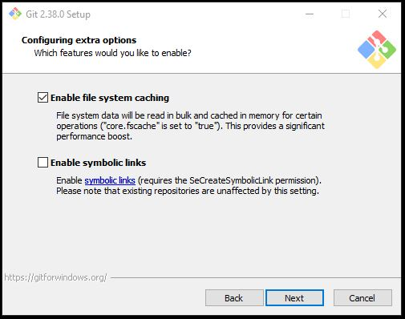

---

# Git Install instructions

+ [Download git here (v2.38.0; 64-bit version for Windows)](https://github.com/git-for-windows/git/releases/download/v2.38.0.windows.1/Git-2.38.0-64-bit.exe)

+ Once downloaded, right-click install, and run as administrator.

  + The local install path should be `C:\Program Files\Git`:
    + 
  
  
  
---

# Git Install instructions

## Defaults to set

+ Select default components (**nothing to tick/untick here**)
  + {width=80%}

---

# Git Install instructions

## Defaults to set

  + Change default text editor for git
    + {width=60%}
    + You can set this to your favourite text editor <smaller>(Notepad ++, Sublime, VSCode etc.)</smaller>
    + Make sure that the selected text editor is installed to proceed.
    + If you don't know what to choose, choose Notepad for now.
 
---

# Git Install instructions

## Defaults to set

+ Override the default branch name in git to "main"
  + {width=80%}
  
---

# Git Install instructions

## Defaults to set

+ Select "Use Git from Git Bash only"

  + {width=80%}

---

# Git Install instructions

## Defaults to set

+ Use bundled OpenSSH"

  + {width=80%}

---

# Git Install instructions

## Defaults to set

+ Use the OpenSSL Library
  + {width=80%}

---

# Git Install instructions

## Defaults to set

+ Checkout Windows-style, commit Unix-style line endings
  + {width=80%}

---

# Git Install instructions

## Defaults to set

+ Use MinTTYP (the default terminal of MSYS2)
  + {width=80%}

---

# Git Install instructions

## Defaults to set

+ Choose the default (fast-forward or merge) as the standard behaviour of git pull
  + {width=75%}
  
---  

# Git Install instructions

## Defaults to set

  + Install Git Credential Manager as credential helper
    + {width=80%}
    
---  

# Git Install instructions

## Defaults to set

  + Enable file system caching
    + {width=80%}

---

# Git Install instructions

## Defaults to set

+ **Don't** enable experimental options
  + {width=80%}
  
---

# {.standout}

That's it!